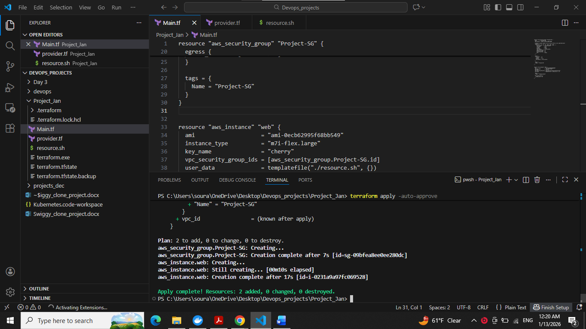
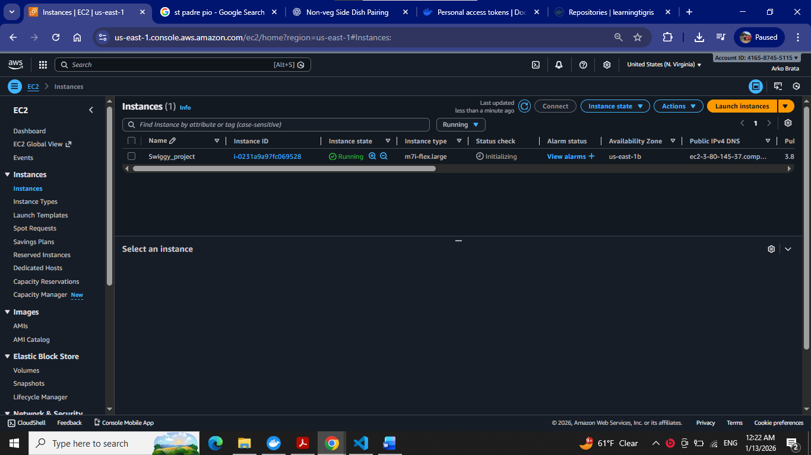
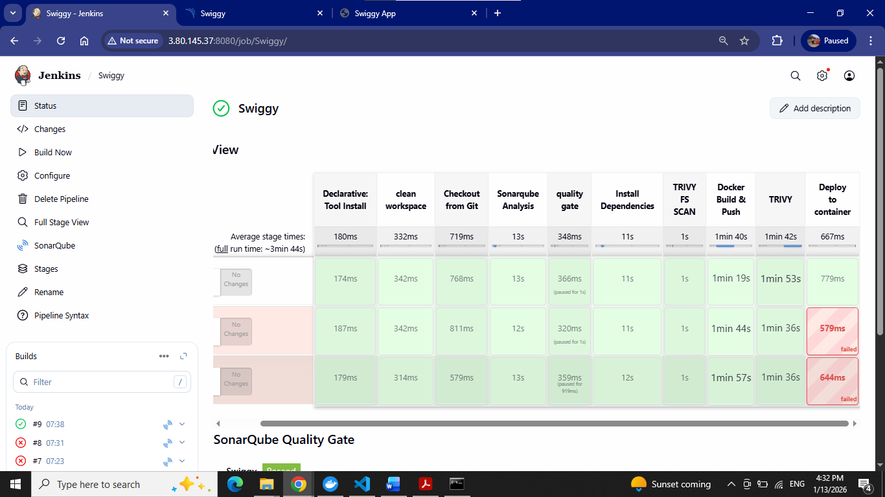
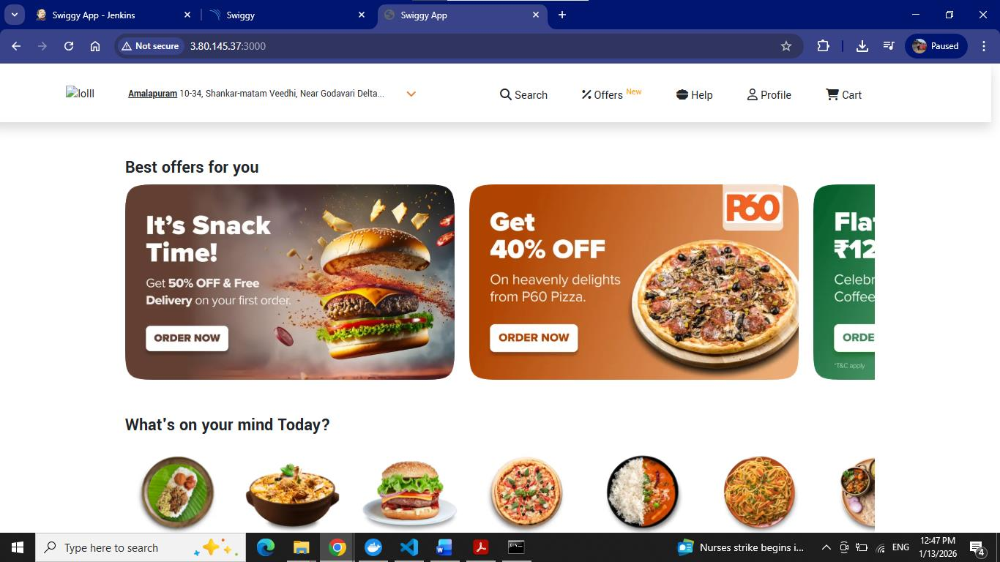

# 🚀 Swiggy DevOps CI/CD Pipeline

## 📌 Project Overview

This project demonstrates a complete End-to-End DevOps CI/CD Pipeline for deploying a Swiggy-based web application on AWS using modern DevOps tools and practices.

The objective of this project is to automate infrastructure provisioning, code quality analysis, security scanning, containerization, and deployment using industry-standard DevOps tools.

---

## 🏗️ Architecture

```text
GitHub
   ↓
Jenkins
   ↓
SonarQube Analysis
   ↓
Quality Gate Validation
   ↓
Trivy Security Scan
   ↓
Docker Build
   ↓
DockerHub Push
   ↓
AWS EC2 Deployment
```

---

## 🛠️ Tools & Technologies

| Tool | Purpose |
|--------|----------|
| Terraform | Infrastructure as Code (IaC) |
| AWS EC2 | Cloud Infrastructure |
| Jenkins | CI/CD Automation |
| SonarQube | Code Quality Analysis |
| Trivy | Security Vulnerability Scanning |
| Docker | Containerization |
| DockerHub | Container Registry |
| GitHub | Source Code Management |

---

## ⚙️ Features

- Infrastructure provisioning using Terraform
- Automated CI/CD pipeline using Jenkins
- Static code analysis using SonarQube
- Quality Gate validation
- Security vulnerability scanning using Trivy
- Docker image build and deployment
- DockerHub image repository integration
- AWS EC2 application hosting
- Automated application deployment

---

## 📂 Repository Structure

```text
swiggy-devops-cicd-pipeline/
│
├── terraform/
│   ├── main.tf
│   ├── provider.tf
│   └── resource.sh
│
├── jenkins/
│   └── Jenkinsfile
│
├── docs/
│   └── Swiggy-DevOps-Project.pdf
│
├── screenshots/
│   ├── jenkins-pipeline.png
│   ├── sonarqube-dashboard.png
│   ├── terraform-apply.png
│   ├── ec2-instance.png
│   └── final-application.png
│
├── README.md
└── .gitignore
```

---

## 🔄 CI/CD Pipeline Workflow

### Step 1: Infrastructure Provisioning

Terraform provisions the AWS infrastructure including:

- EC2 Instance
- Security Groups
- Network Configuration

```bash
terraform init
terraform plan
terraform apply
```

---

### Step 2: Jenkins Setup

Jenkins is installed automatically through the bootstrap script and configured for CI/CD operations.

Services installed:

- Java 17
- Jenkins
- Docker
- SonarQube
- Trivy

---

### Step 3: Source Code Checkout

Jenkins pulls the latest source code from GitHub.

---

### Step 4: SonarQube Analysis

Static code analysis is performed to identify:

- Code smells
- Bugs
- Vulnerabilities
- Maintainability issues

---

### Step 5: Quality Gate Validation

Jenkins waits for SonarQube Quality Gate results before proceeding.

If the quality gate fails, the pipeline stops automatically.

---

### Step 6: Trivy Security Scan

Trivy scans:

- Source code filesystem
- Docker image vulnerabilities

This ensures secure deployment practices.

---

### Step 7: Docker Build

Docker image is built from the application source code.

```bash
docker build -t swiggy .
```

---

### Step 8: Push to DockerHub

Docker image is tagged and pushed to DockerHub.

```bash
docker push learningtigris/swiggy:latest
```

---

### Step 9: Deployment

The application is deployed as a Docker container on AWS EC2.

```bash
docker run -d -p 3000:3000 learningtigris/swiggy:latest
```

---

## ☁️ AWS Services Used

- Amazon EC2
- IAM
- Security Groups
- VPC Networking

---

## 🔐 DevSecOps Practices Implemented

- Static Code Analysis
- Quality Gate Validation
- Filesystem Vulnerability Scanning
- Docker Image Vulnerability Scanning
- Secure Credential Management
- Infrastructure as Code

---

## 🎯 Skills Demonstrated

### DevOps

- CI/CD Pipeline Design
- Jenkins Automation
- GitHub Integration
- Pipeline Troubleshooting

### Cloud

- AWS EC2 Administration
- IAM Configuration
- Infrastructure Provisioning

### Containerization

- Docker Build & Deployment
- DockerHub Registry Management

### Security

- SonarQube Analysis
- Trivy Vulnerability Scanning
- DevSecOps Best Practices

### Infrastructure as Code

- Terraform Configuration
- Automated Infrastructure Deployment

---

## 📸 Screenshots

### Terraform Infrastructure Provisioning



---

### AWS EC2 Instance



---

### Jenkins Pipeline



---

### Final Application Deployment



---

## 🚀 Future Enhancements

- Kubernetes Deployment
- Helm Charts
- ArgoCD Integration
- AWS EKS Deployment
- Monitoring with Prometheus & Grafana
- Automated Notifications using Slack
- Multi-Environment Deployment (Dev, QA, Prod)

---

## 👨‍💻 Author

### Arkobrata Chatterjee

DevOps | Cloud | AWS | Terraform | Jenkins | Docker

GitHub: https://github.com/learningtigris